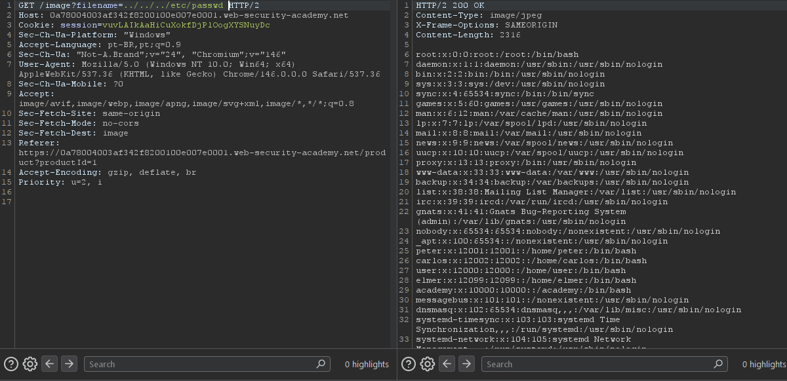

# Lab: File path traversal, simple case

**Módulo:** Server-side vulnerabilities //
**Dificuldade:** Apprentice //
**Categoria:** Path traversal //
**Status:** Resolvida //

## Objetivo

Pede para que acessemos o conteúdo do caminho "/etc/passwd".

## Reconhecimento

Assim como informado pelo enunciado, este lab tem uma "path traversal vulnerability" na hora de mostrar as imagens dos produtos.

## Abordagem

- O primeiro ato a se fazer foi: Efetuar um reconhecimento visual do site, e de como ele funciona. 
- Agora, com base no que o enunciado pediu e no que nós informa, foi possivel saber o próximo passo.
- Usando o [BurpSuite] e o site ao mesmo tempo, usamos o filtro do proxy para capturar as imagens de dentro do site.
- Ao capturarmos o GET [GET /image?filename=1.jpg], foi então que foi feito proveito da vulneralidade.


## Payload / Técnica utilizada

```
A forma que executamos foi modificar o GET da imagem para acessar o caminho pedido.
Jogamos o pedido GET no repeater, e a partir disso conseguimos acessar.


payload usado foi:  ../../../etc/passwd [RESULTADO FICOU COMO: GET /image?filename=../../../etc/passwd HTTP/2]  

```
O site tem uma função que carrega imagens baseada em um parâmetro na URL. Internamente, o servidor pega esse parâmetro e concatena com um diretório fixo para montar o caminho completo do arquivo. Como o servidor não valida o que é passado, eu posso usar ../ para subir diretórios — saindo da pasta de imagens — e acessar qualquer arquivo do sistema, como /etc/passwd. O sistema operacional resolve os ../ como 'voltar uma pasta', então ../../../etc/passwd a partir da pasta de imagens acaba apontando para /etc/passwd.

## Evidência



## Resultado

Ao final, conseguimos ter acesso ao banco de dados essencial para o sistema operacional, armazenando os detalhes das contas dos usuários.

## Observações técnicas

Por que o servidor não bloqueia? Porque o desenvolvedor não implementou nenhuma sanitização no parâmetro filename. Ele deveria ter feito algo como:

- Verificar se o caminho final realmente começa com /var/www/html/images/
- Remover ou bloquear .. do parâmetro
- Usar uma lista branca (whitelist) de arquivos permitidos
- Mas como não fez, o atacante(EU) consegue "escapar" do diretório restrito e navegar por todo o sistema de arquivos do servidor.

## Referências

- [PortSwigger Web Security Academy](https://portswigger.net/support/using-burp-to-test-for-path-traversal-vulnerabilities) (link para o tópico, não para a lab específica com solução)
