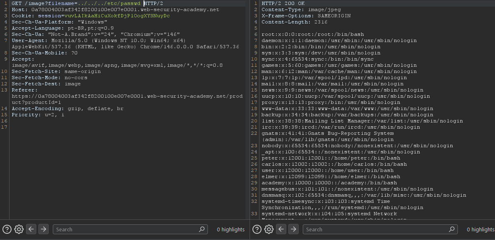

> 🌐 **English** | [Português](LAB-01.pt-BR.md)

# Lab: File path traversal, simple case

**Module:** Server-side vulnerabilities //
**Difficulty:** Apprentice //
**Category:** Path traversal //
**Status:** Solved //

## Goal

Retrieve the contents of the `/etc/passwd` file.

## Recon

As stated in the lab description, this lab has a path traversal vulnerability in the way it displays product images.

## Approach

- The first step was a visual recon of the site to understand how it works.
- Based on what the lab description asked for and the hints it provided, it was possible to identify the next step.
- Using Burp Suite and the site at the same time, I used the proxy filter to capture the requests loading the site's images.
- Once I captured the `GET /image?filename=1.jpg` request, that's where the vulnerability was exploited.

## Payload / Technique used

```
The approach was to modify the image GET request to reach the requested path.
I sent the GET request to Repeater, and from there I was able to access the file.

Payload used: ../../../etc/passwd  [RESULT: GET /image?filename=../../../etc/passwd HTTP/2]
```

The site has a feature that loads images based on a URL parameter. Internally, the server takes that parameter and concatenates it with a fixed directory to build the full file path. Since the server doesn't validate the input, I can use `../` to move up directories — escaping the images folder — and reach any file on the system, such as `/etc/passwd`. The operating system resolves each `../` as "go up one directory", so `../../../etc/passwd` starting from the images folder ends up pointing to `/etc/passwd`.

## Evidence



## Result

In the end, I gained access to a file that is essential to the operating system, which stores the details of user accounts.

## Technical notes

Why doesn't the server block this? Because the developer didn't implement any sanitization on the `filename` parameter. They should have done something like:

- Verify that the final path actually starts with `/var/www/html/images/`
- Strip or block `..` from the parameter
- Use a whitelist of allowed files

Since none of that was done, the attacker (me) is able to "escape" the restricted directory and browse the server's entire file system.

## References

- [PortSwigger Web Security Academy](https://portswigger.net/support/using-burp-to-test-for-path-traversal-vulnerabilities) (link to the topic, not to the specific lab solution)