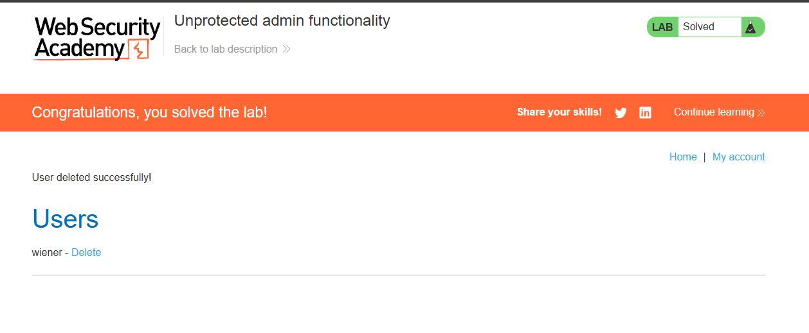

# Lab: Unprotected admin functionality

**Módulo:** Server-side vulnerabilities //
**Dificuldade:** Apprentice //
**Categoria:** Access control //
**Status:**  Resolvida //

## Objetivo

Lab pede para que seja acessado o painel administrador e que o usuario CARLOS seja deletado.

# Reconhecimento

Assim como informado pelo enunciado, este lab tem uma um painel administrativo sem proteção. 
Com essa ideia, deveriamos apenas descobrir qual o URl feito. 
Na explicação anterior ao lab, foi dito que também poderia haver arquivos internos com acesso (nesse caso, robots.txt), devido a isso só foi usado a lógica basica. 

## Abordagem

- O primeiro ato a se fazer foi: Efetuar um reconhecimento visual do site, e de como ele funciona. 
- Agora, com base no que o enunciado pediu e no que nós informa, foi possivel saber o próximo passo.
- Desta vez, foi possivel usar somente o site para efetuarmos a abordagem.
- Tendo ciencia do caminho comentado na explicação "/robots.txt", entramos e descobrimos a URl do painel
- Após entrar no painel, só excluimos o usuario pedido.


## Payload / Técnica utilizada

```

Tecnica simples de teste de URl(/robots.txt), onde testamos URL's para verificar se há algo exposto(/administrator-panel). Neste caso, havia e era obvio, mas em outras situações há proteção.

```

Primeiro é preciso entender a existencia do arquivo robots.txt:  é extremamente comum e essencial. Ele atua como um guia na raiz do seu site que instrui robôs de mecanismos de busca (como o Googlebot) sobre quais páginas ou pastas eles **não devem acessar**, ajudando a otimizar o orçamento de rastreamento do site. 
Quando um desenvolvedor quer esconder uma página administrativa dos mecanismos de busca, ele faz algo como:

```
User-agent: *
Disallow: /administrator-panel

```
A intenção é dizer: "Google, não mostre isso nos resultados de busca."
O que ele não percebe é que: ele acabou de revelar para qualquer atacante exatamente onde fica o painel administrativo. O arquivo é público, então qualquer pessoa, incluindo um invasor, pode ler essa info.

## Evidência



## Resultado

Ao final, conseguimos deletar o usuario CARLOS devido a falha de segurança contida. 

## Observações técnicas

Por que isso não funciona em sites bem protegidos?
Se o site tiver:

- Autenticação no painel (login + senha)
- Firewall bloqueando IPs não autorizados
- Controle de acesso por roles/permissões...mesmo que você descubra a URL pelo robots.txt, você não conseguirá fazer nada, pois há há uma barreira. Somente o conhecimento da URL não é o suficiente, é preciso passar pela autenticação.

## Referências

- [PortSwigger Web Security Academy](https://portswigger.net/web-security/access-control) (link para o tópico, não para a lab específica com solução)
