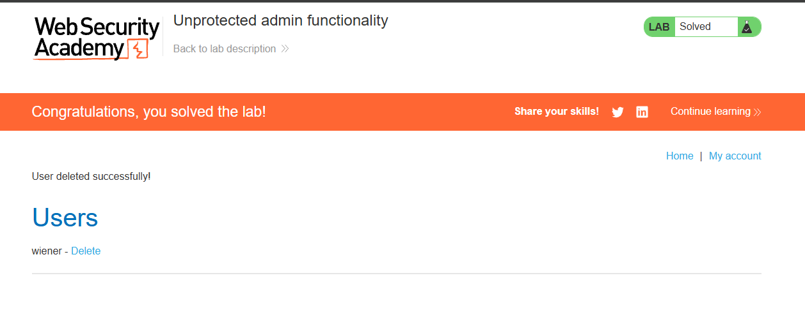

> 🌐 [English](LAB-01.md) | **Português**

# Lab: Unprotected admin functionality

**Módulo:** Server-side vulnerabilities //
**Dificuldade:** Apprentice //
**Categoria:** Access control //
**Status:** Resolvida //

## Objetivo

O lab pede para que seja acessado o painel administrador e que o usuário CARLOS seja deletado.

## Reconhecimento

Assim como informado pelo enunciado, este lab tem um painel administrativo sem proteção.
Com essa ideia, deveríamos apenas descobrir qual o URL exposto.
Na explicação anterior ao lab, foi dito que também poderia haver arquivos internos com dicas de acesso (nesse caso, `robots.txt`); por isso, só foi usada a lógica básica.

## Abordagem

- O primeiro passo foi efetuar um reconhecimento visual do site e de como ele funciona.
- Com base no que o enunciado pediu e nas dicas que ele nos dá, foi possível identificar o próximo passo.
- Desta vez, foi possível usar somente o site para efetuar a abordagem.
- Tendo ciência do caminho comentado na explicação (`/robots.txt`), entrei e descobri a URL do painel.
- Após entrar no painel, só excluí o usuário pedido.

## Payload / Técnica utilizada

```
Técnica simples de teste de URL (/robots.txt), onde testamos URLs para verificar se há algo exposto (/administrator-panel).
Neste caso havia e era óbvio, mas em outras situações há proteção.
```

Primeiro é preciso entender a existência do arquivo `robots.txt`: extremamente comum e essencial. Ele atua como um guia na raiz do site que instrui os robôs dos mecanismos de busca (como o Googlebot) sobre quais páginas ou pastas eles **não devem acessar**, ajudando a otimizar o orçamento de rastreamento (crawl budget) do site.
Quando um desenvolvedor quer esconder uma página administrativa dos mecanismos de busca, ele faz algo como:

```
User-agent: *
Disallow: /administrator-panel
```

A intenção é dizer: "Google, não mostre isso nos resultados de busca."
O que ele não percebe é que acabou de revelar para qualquer atacante exatamente onde fica o painel administrativo. O arquivo é público, então qualquer pessoa (incluindo um invasor / VOCÊ) pode ler essa info.

## Evidência



## Resultado

Ao final, consegui deletar o usuário CARLOS devido à falha de segurança contida.

## Observações técnicas

Por que isso não funciona em sites bem protegidos?
Se o site tiver:

- Autenticação no painel (login + senha)
- Firewall bloqueando IPs não autorizados
- Controle de acesso por roles/permissões

...mesmo que você descubra a URL pelo `robots.txt`, não conseguirá fazer nada, pois há uma barreira. Somente o conhecimento da URL não é suficiente: é preciso passar pela autenticação.

## Referências

- [PortSwigger Web Security Academy](https://portswigger.net/web-security/access-control) (link para o tópico, não para a lab específica com solução)
