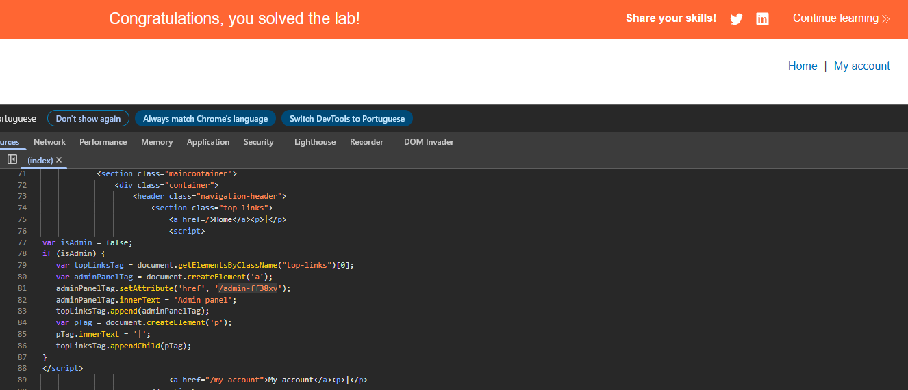

# Lab: Unprotected admin functionality with unpredictable URL

**Módulo:** Server-side vulnerabilities //
**Dificuldade:** Apprentice //
**Categoria:** Access control //
**Status:**  Resolvida //

## Objetivo

Igual ao anterior, devemos acessar o painel admin do sistema, mas dessa vez a URL está localizada de forma diferente dentro da aplicação.
Devemos descobrir e deleter o user CARLOS

# Reconhecimento

Assim como informado pelo enunciado, este lab tem uma um painel administrativo sem proteção, mas com a URL aplicada de forma diferente. Com essa ideia, testamos o /robots.txt para verificar se retornaria algo interessante, mas nada incomum. Pensando assim, precisamos seguir por outro caminho, por isso foi usado o modo desenvolvedor para tal.

## Abordagem

- Foi realizado um reconhecimento visual da aplicação para compreender sua estrutura e funcionamento.
- Com base nas informações fornecidas pelo enunciado, foi possível definir o próximo passo da análise.
- Utilizando as ferramentas de desenvolvedor do navegador (F12), foram inspecionados os elementos da página, porém nenhuma informação relevante foi encontrada.
- A análise foi então direcionada para a aba **Sources**, em busca de arquivos expostos que pudessem conter informações sensíveis.
- Foi identificado o arquivo `index`, que estava acessível sem qualquer proteção.
- Após analisar seu conteúdo, foi encontrado o diretório administrativo `/admin-ff38xv`, permitindo dar continuidade ao laboratório.

## Payload / Técnica utilizada

- Reconhecimento de aplicação web.
- Inspeção do código-fonte utilizando as DevTools do navegador.
- Análise de arquivos expostos (*Source Code Disclosure*).

Neste laboratório não foi necessário utilizar payloads ou manipular requisições. A exploração consistiu apenas na análise do código-fonte exposto para identificar informações sensíveis, resultando na descoberta do diretório administrativo.

## Evidência

## Resultado

Usuario excluido com sucesso ao invadir o painel admin.

## Observações técnicas
Falha de Controle de Acesso. A rota /admin-ff38xv não implementa:

- Verificação de sessão (cookie de autenticação)
- Middleware de autorização
- Token CSRF
- Qualquer tipo de validação server-side
O servidor aceita requisições GET para essa rota de qualquer origem, sem checar quem está fazendo a requisição.

## Referências

- [PortSwigger Web Security Academy](https://portswigger.net/web-security/access-control) (link para o tópico, não para a lab específica com solução)
