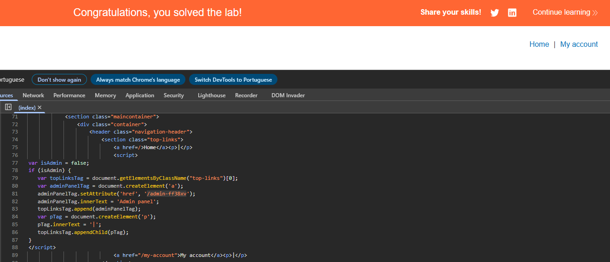

> 🌐 **English** | [Português](LAB-02.pt-BR.md)

# Lab: Unprotected admin functionality with unpredictable URL

**Module:** Server-side vulnerabilities //
**Difficulty:** Apprentice //
**Category:** Access control //
**Status:** Solved //

## Goal

Same as the previous lab: we must access the system's admin panel, but this time the URL is placed differently within the application.
We must find it and delete the user CARLOS.

## Recon

As stated in the lab description, this lab has an unprotected admin panel, but with the URL exposed differently. With that in mind, I tested `/robots.txt` to see whether it would return anything interesting, but nothing unusual came up. So I had to take another route, and for that I used the browser's developer tools.

## Approach

- A visual recon of the application was performed to understand its structure and behavior.
- Based on the information provided by the lab description, it was possible to define the next step of the analysis.
- Using the browser's developer tools (F12), the page elements were inspected, but no relevant information was found.
- The analysis was then directed to the **Sources** tab, looking for exposed files that could contain sensitive information.
- The `index` file was identified, accessible without any protection.
- After analyzing its contents, the admin directory `/admin-ff38xv` was found, allowing me to continue the lab.

## Payload / Technique used

- Web application recon.
- Source-code inspection using the browser DevTools.
- Analysis of exposed files (*Source Code Disclosure*).

In this lab it was not necessary to use payloads or manipulate requests. The exploitation consisted only of analyzing the exposed source code to identify sensitive information, resulting in the discovery of the admin directory.

## Evidence

## Result

User deleted successfully after breaking into the admin panel.

## Technical notes

Broken Access Control. The `/admin-ff38xv` route does not implement:

- Session verification (authentication cookie)
- Authorization middleware
- CSRF token
- Any kind of server-side validation

The server accepts GET requests to this route from any origin, without checking who is making the request.

## References

- [PortSwigger Web Security Academy](https://portswigger.net/web-security/access-control) (link to the topic, not to the specific lab solution)
