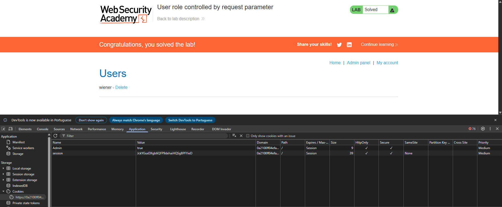

# Lab: User role controlled by request parameter

**Módulo:** Server-side vulnerabilities //
**Dificuldade:** Apprentice //
**Categoria:** Access control //
**Status:**  Resolvida //

## Objetivo

- Este laboratório possui um painel de administração em /admin, que identifica os administradores por meio de um cookie que pode ser falsificado.
- Resolva o laboratório acessando o painel de administração e usando-o para excluir o usuário carlos.
- Você pode fazer login na sua própria conta usando as seguintes credenciais: wiener:peter

# Reconhecimento

Assim como informado pelo enunciado, este lab tem uma um painel administrativo, mas com acesso somnete com o perfil correto. Com essa ideia, nosso objetivo é burlar essa proteção.

## Abordagem
- Foi realizado um reconhecimento visual da aplicação para compreender sua estrutura e funcionamento.
- Com base nas informações fornecidas pelo enunciado, foi possível definir o próximo passo da análise.
- Nesse caso há duas formas de prosseguirmos: A primeira é interceptar via burp suite, mas iremos pela segunda opção.
- Como segunda forma, simplesmente logamos no usuario e logamos via as credencias passadas pelo enunciado. 
- Após isso, analisamos foi aba **Application**, em busca de vulnerabilidades na sub-aba **Storage**.
- Após analisar seu conteúdo, foi encontrado que o CARGO de Admin pode ser modificado via cookies.
- Com isso, mudamos o admin=true

## Payload / Técnica utilizada

Neste laboratório não foi necessário utilizar payloads ou manipular requisições. A exploração consistiu apenas na análise do código-fonte exposto para identificar informações sensíveis, resultando na descoberta do diretório administrativo.

## Evidência

## Resultado

Usuario excluido com sucesso ao invadir o painel admin.

## Observações técnicas

- Nunca armazenar papéis/permissões em cookies. Use apenas um ID de sessão aleatório.
- Validar autorização no servidor a cada requisição a páginas sensíveis, consultando o banco de dados ou a sessão.
- Usar sessões server-side (PHP nativo, Redis, banco de dados) em vez de cookies editáveis.
- Assinar/criptografar cookies se precisar armazenar dados no cliente (ex: JWT com assinatura).
- Testar se um usuário comum consegue acessar /admin ou se consegue modificar cookies manualmente — isso já teria detectado a falha.

## Referências

- [PortSwigger Web Security Academy](https://portswigger.net/web-security/access-control) (link para o tópico, não para a lab específica com solução)

