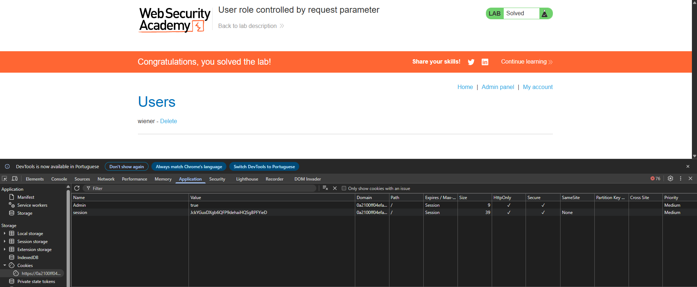

> 🌐 [English](LAB-03.md) | **Português**

# Lab: User role controlled by request parameter

**Módulo:** Server-side vulnerabilities //
**Dificuldade:** Apprentice //
**Categoria:** Access control //
**Status:** Resolvida //

## Objetivo

- Este laboratório possui um painel de administração em `/admin`, que identifica os administradores por meio de um cookie que pode ser falsificado.
- Resolva o laboratório acessando o painel de administração e usando-o para excluir o usuário carlos.
- Você pode fazer login na sua própria conta usando as seguintes credenciais: `wiener:peter`.

## Reconhecimento

Assim como informado pelo enunciado, este lab tem um painel administrativo, mas com acesso somente com o perfil correto. Com essa ideia, nosso objetivo é burlar essa proteção.

## Abordagem

- Foi realizado um reconhecimento visual da aplicação para compreender sua estrutura e funcionamento.
- Com base nas informações fornecidas pelo enunciado, foi possível definir o próximo passo da análise.
- Nesse caso há duas formas de prosseguir: a primeira é interceptar via Burp Suite, mas iremos pela segunda opção.
- Como segunda forma, simplesmente logamos no usuário com as credenciais passadas pelo enunciado.
- Após isso, analisamos a aba **Application**, em busca de vulnerabilidades na sub-aba **Storage**.
- Após analisar seu conteúdo, foi encontrado que o CARGO de Admin pode ser modificado via cookies.
- Com isso, mudamos o `admin=true`.

## Payload / Técnica utilizada

- Inspeção dos dados armazenados no navegador (Application → Storage → Cookies).
- Manipulação de um cookie client-side para escalar privilégios (escalonamento vertical).

Neste laboratório não foi necessário interceptar requisições com o Burp (embora o mesmo resultado seja obtido editando o header `Cookie` no Proxy/Repeater). A exploração consistiu em editar o valor do cookie `Admin` no storage do navegador de `false` para `true`. Como o servidor confia nesse cookie controlado pelo cliente como fonte de verdade para o cargo do usuário — em vez de derivar o cargo no servidor a partir da sessão — reenviar qualquer requisição com `Admin=true` é suficiente para ser tratado como administrador e acessar `/admin`.

## Evidência

## Resultado

Usuário excluído com sucesso ao invadir o painel admin.

## Observações técnicas

- Nunca armazenar papéis/permissões em cookies. Use apenas um ID de sessão aleatório.
- Validar autorização no servidor a cada requisição a páginas sensíveis, consultando o banco de dados ou a sessão.
- Usar sessões server-side (PHP nativo, Redis, banco de dados) em vez de cookies editáveis.
- Assinar/criptografar cookies se precisar armazenar dados no cliente (ex: JWT com assinatura).
- Testar se um usuário comum consegue acessar `/admin` ou modificar cookies manualmente — isso já teria detectado a falha.

## Referências

- [PortSwigger Web Security Academy](https://portswigger.net/web-security/access-control) (link para o tópico, não para a lab específica com solução)
