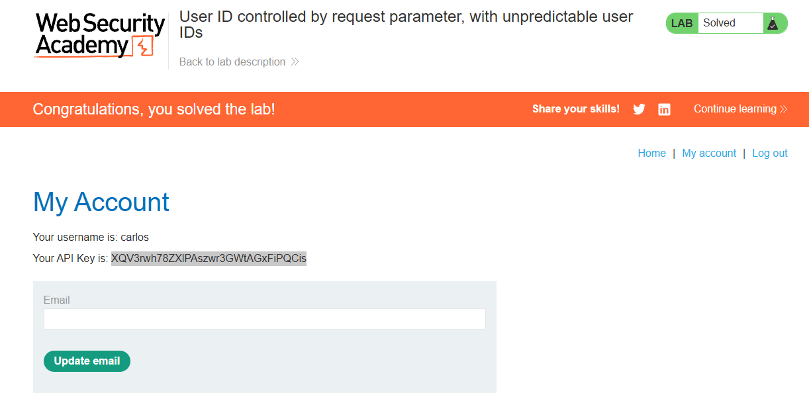

# Lab: User ID controlled by request parameter, with unpredictable user IDs

**Módulo:** Server-side vulnerabilities //
**Dificuldade:** Apprentice //
**Categoria:** Access control //
**Status:**  Resolvida //

## Objetivo

Este laboratório apresenta uma vulnerabilidade de escalonamento de privilégios horizontal na página da conta do usuário, mas identifica os usuários por meio de GUIDs.

Para resolver o laboratório, encontre o GUID do usuário “carlos” e, em seguida, envie a chave de API dele como solução.

Você pode fazer login na sua própria conta usando as seguintes credenciais: wiener:peter

# Reconhecimento

Assim como informado previamente, este lab contem um vuln do tipo escalonamento (**Broken Access Control**) via falha de GUIDs. Com esta ideia, iremos verificar URL's e arquivos via inspeção de elementos.

## Abordagem

- Foi realizado um reconhecimento visual da aplicação para compreender sua estrutura e funcionamento.
- Com base nas informações fornecidas pelo enunciado, foi possível definir o próximo passo da análise.
- Primeiro, foi verificado via inspeção de elementos se há algo de estranho que possa ser usado.
- Como nada foi descoberto, partimos para verificar o site de forma mais detalhada.
--
- Ao analisar o site de forma mais detalhista, foi reconhecido uma falha via URL's ao acessar postagens referentes aos usuario.
- Ao perceber isso, foi possivel identificar o GUID do usuario pedido, e logo, feito a solicitação pedida pelo LAB.

## Payload / Técnica utilizada

- Reconhecimento de aplicação web.

Neste laboratório não foi necessário utilizar payloads ou manipular requisições. A exploração consistiu apenas na análise de falhas Web com base na descrição do Lab.

## Evidência

## Resultado

Submetido o GUID ao Lab, assim como pedido.

## Observações técnicas

-- Falha de Controle de Acesso Horizontal (IDOR). A rota /my-account não implementa:

- Verificação de identidade do proprietário do recurso — o servidor não compara o userId da sessão autenticada com o userId passado no parâmetro id
- Middleware de autorização — não há qualquer camada interceptando a requisição para validar se o usuário pode acessar o perfil solicitado
- Vínculo entre sessão e recurso — a rota aceita qualquer GUID válido no parâmetro id, independentemente de quem está logado
- Ofuscação de identificadores em conteúdo público — GUIDs de usuários são expostos em elementos HTML da aplicação (comentários, links de postagens, metadados), permitindo enumeração passiva
- O servidor aceita requisições GET para /my-account?id=QUALQUER_GUID de qualquer usuário autenticado, sem verificar se o GUID requisitado pertence à sessão ativa.

## Referências

- [PortSwigger Web Security Academy](https://portswigger.net/web-security/access-control) (link para o tópico, não para a lab específica com solução)

