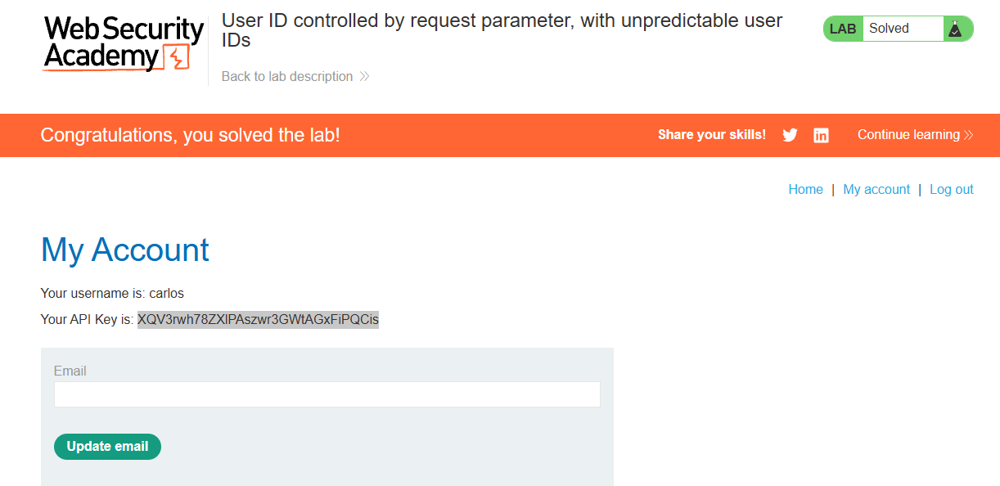

> 🌐 [English](LAB-04.md) | **Português**

# Lab: User ID controlled by request parameter, with unpredictable user IDs

**Módulo:** Server-side vulnerabilities //
**Dificuldade:** Apprentice //
**Categoria:** Access control //
**Status:** Resolvida //

## Objetivo

Este laboratório apresenta uma vulnerabilidade de escalonamento de privilégios horizontal na página da conta do usuário, mas identifica os usuários por meio de GUIDs.

Para resolver o laboratório, encontre o GUID do usuário "carlos" e, em seguida, envie a chave de API dele como solução.

Você pode fazer login na sua própria conta usando as seguintes credenciais: `wiener:peter`.

## Reconhecimento

Assim como informado previamente, este lab contém uma vuln do tipo escalonamento (**Broken Access Control**) via falha de GUIDs. Com esta ideia, iremos verificar URLs e arquivos via inspeção de elementos.

## Abordagem

- Foi realizado um reconhecimento visual da aplicação para compreender sua estrutura e funcionamento.
- Com base nas informações fornecidas pelo enunciado, foi possível definir o próximo passo da análise.
- Primeiro, foi verificado via inspeção de elementos se havia algo de estranho que pudesse ser usado.
- Como nada foi descoberto, partimos para verificar o site de forma mais detalhada.
- Ao analisar o site de forma mais detalhista, foi reconhecida uma falha via URLs ao acessar as postagens do blog: o nome de cada autor aponta para `/blogs?userId=<GUID>`, vazando o GUID do usuário em conteúdo público.
- De posse do GUID do carlos, requisitei `/my-account?id=<GUID_carlos>`. O servidor retornou a página da conta dele — incluindo a API key — sem verificar se o GUID pertencia à minha sessão.
- Extraí a API key e a submeti como solução do laboratório.

## Payload / Técnica utilizada

- Reconhecimento de aplicação web (enumeração passiva de GUID a partir do conteúdo público do blog).
- IDOR em `/my-account?id=<GUID>` — acesso direto à página de conta de outro usuário.

Não foi necessário ferramental automatizado nem manipulação de requisição além de trocar o parâmetro `id`. O GUID (imprevisível por design) estava vazado no próprio HTML da aplicação, anulando a mitigação de "ID imprevisível".

## Evidência

## Resultado

O GUID do carlos foi recuperado dos links públicos do blog, usado para acessar a página de conta dele via IDOR, e a API key foi extraída e submetida como solução do laboratório.

## Observações técnicas

Falha de Controle de Acesso Horizontal (IDOR). A rota `/my-account` não implementa:

- Verificação de identidade do proprietário do recurso — o servidor não compara o `userId` da sessão autenticada com o `userId` passado no parâmetro `id`.
- Middleware de autorização — não há qualquer camada interceptando a requisição para validar se o usuário pode acessar o perfil solicitado.
- Vínculo entre sessão e recurso — a rota aceita qualquer GUID válido no parâmetro `id`, independentemente de quem está logado.
- Ofuscação de identificadores em conteúdo público — GUIDs de usuários são expostos em elementos HTML da aplicação (comentários, links de postagens, metadados), permitindo enumeração passiva.

O servidor aceita requisições GET para `/my-account?id=QUALQUER_GUID` de qualquer usuário autenticado, sem verificar se o GUID requisitado pertence à sessão ativa.

## Referências

- [PortSwigger Web Security Academy](https://portswigger.net/web-security/access-control) (link para o tópico, não para a lab específica com solução)
