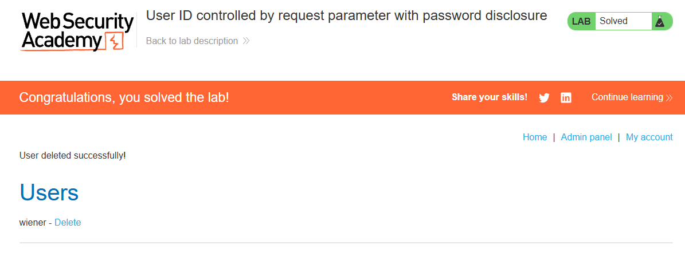

# Lab: User ID controlled by request parameter with password disclosure

**Módulo:** Server-side vulnerabilities //
**Dificuldade:** Apprentice //
**Categoria:** Access control //
**Status:**  Resolvida //

## Objetivo

Este laboratório possui uma página de conta de usuário que contém a senha atual do usuário, pré-preenchida em um campo de entrada mascarado.
Para resolver o laboratório, recupere a senha do administrador e, em seguida, use-a para excluir o usuário carlos.
Você pode fazer login na sua própria conta usando as seguintes credenciais: wiener:peter


# Reconhecimento

Primeiro é preciso entender que o Lab tem uma falha de escalonamento de privilegio "horizontal para vertical". Onde um usuario comum sobe seus privilegios de alguma forma.

Nível de privilégio
                   ▲
                   │
      VERTICAL     │        Admin / Root
      (sobe)       │
                   │
      ─────────────┼───────────────────
                   │
      HORIZONTAL   │    Usuário A  ←→  Usuário B
      (mesmo nível)│    (comum)         (comum)
                   │
                   │        Usuário C
                   │        (convidado / restrito)
                   ▼


## Abordagem

- Foi realizado um reconhecimento visual da aplicação para compreender sua estrutura e funcionamento.
- Com base nas informações fornecidas pelo enunciado, foi possível definir o próximo passo da análise.
- Sabendo o tipo de falha que há, fomos direto tentar verificar via inspeção de elementos, ver se há algo relacionado ao GUID ou algum arquivo aberto, mas sem resultado. 
- Levando em conta que o ID fica exposto na URL, usamos isso mudando a URL de wiener para administrador
- Por surpresa (quase obvia), era este o segredo para acessar, mas ainda faltava acessar a senha do usuario admin
- levando em conta isso, usamos o BURP para capturar a solicitação de login do administrador e por tabela, a senha

```

<input required type="hidden" name="csrf" value="ePvtmGS5RalP3yR9KaVkvHYfCP5BHg4N">
<input required type=password name=password **value='gtmaghlyeiy26zjvd4fb'** />

```
- Com a senha do administrador em mãos, realizamos o login como administrator e navegamos até o painel administrativo (/admin).
- Localizamos o usuário carlos e utilizamos a opção Delete para excluí-lo, resolvendo o laboratório.


## Payload / Técnica utilizada

- Manipulação manual do parâmetro id na URL — sem necessidade de ferramentas automatizadas.
- Acesso direto a recurso não autorizado via IDOR.
- A senha do administrador estava exposta em texto plano no atributo value de um campo <input type="password"> na resposta HTML.


## Evidência



## Resultado

A senha do administrador foi extraída via IDOR na rota /my-account e utilizada para autenticar e excluir o usuário carlos no painel administrativo.

## Observações técnicas

### Falha de Controle de Acesso Horizontal/Vertical (IDOR). A rota /my-account não implementa:

- Verificação de identidade do proprietário do recurso — o servidor não compara o userId da sessão autenticada com o userId passado no parâmetro id. Um usuário logado como wiener consegue acessar os dados de administrator simplesmente alterando o parâmetro na URL.
- Middleware de autorização — não há qualquer camada interceptando a requisição para validar se o usuário tem permissão para acessar o perfil solicitado.
- Sanitização de saída — a senha do usuário é retornada no HTML em texto plano no atributo value do campo password, permitindo sua extração via inspeção da resposta HTTP.
- Vínculo entre sessão e recurso — a rota aceita qualquer identificador (wiener, administrator, carlos) no parâmetro id, independentemente de quem está logado.
- O servidor aceita requisições GET /my-account?id=QUALQUER_USUARIO de qualquer usuário autenticado, sem verificar se o id requisitado pertence à sessão ativa.

### Remediação recomendada

- Implementar verificação server-side comparando o parâmetro id com o ID da sessão autenticada.
- Nunca expor senhas no HTML da resposta, mesmo que mascaradas no front-end.
- Utilizar identificadores não sequenciais/imprevisíveis (GUIDs) combinados com autorização em nível de recurso.
- Implementar controle de acesso baseado em função (RBAC) para rotas administrativas.

## Referências

- [PortSwigger Web Security Academy](https://portswigger.net/web-security/access-control) (link para o tópico, não para a lab específica com solução)

