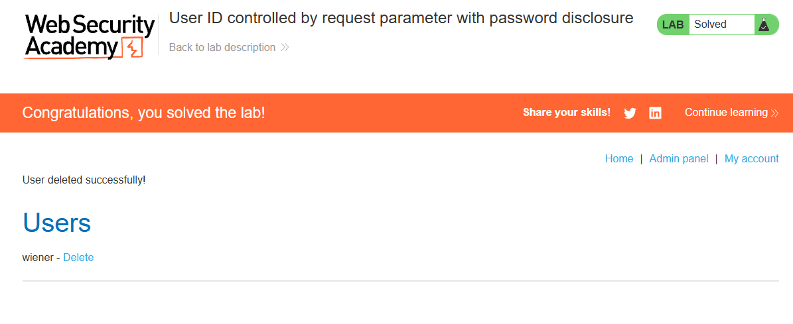

> 🌐 **English** | [Português](LAB-05.pt-BR.md)

# Lab: User ID controlled by request parameter with password disclosure

**Module:** Server-side vulnerabilities //
**Difficulty:** Apprentice //
**Category:** Access control //
**Status:** Solved //

## Goal

This lab has a user account page that contains the current user's password, pre-filled in a masked input field.
To solve the lab, retrieve the administrator's password and then use it to delete the user carlos.
You can log in to your own account with the following credentials: `wiener:peter`.

## Recon

First, you need to understand that the lab has a **horizontal-to-vertical** privilege escalation flaw, where a regular user can elevate their privileges and access administrative resources.

```text
                    Privilege Level
                           ▲
                           │
        VERTICAL           │        Administrator / Root
       (elevation)         │
                           │
───────────────────────────┼──────────────────────────────
                           │
      HORIZONTAL           │    User A  ←→  User B
     (same level)          │    (regular)   (regular)
                           │
                           │    User C
                           │    (guest/restricted)
                           ▼
```

## Approach

- A visual recon of the application was performed to understand its structure and behavior.
- Based on the information provided by the lab description, it was possible to define the next step of the analysis.
- Knowing the type of flaw, we went straight to element inspection to check for anything related to the GUID or any open file, but with no result.
- Considering that the ID is exposed in the URL, we used that by changing the URL from `wiener` to `administrator`.
- To no surprise (almost obvious), that was the trick to gain access — but we still needed the admin user's password.
- With that in mind, we used Burp to capture the administrator's login request and, along with it, the password.

```
<input required type="hidden" name="csrf" value="ePvtmGS5RalP3yR9KaVkvHYfCP5BHg4N">
<input required type=password name=password **value='gtmaghlyeiy26zjvd4fb'** />
```

- With the administrator's password in hand, we logged in as `administrator` and navigated to the admin panel (`/admin`).
- We located the user carlos and used the Delete option to remove him, solving the lab.

## Payload / Technique used

- Manual tampering with the `id` parameter in the URL — no automated tools needed.
- Direct access to an unauthorized resource via IDOR.
- The administrator's password was exposed in plaintext in the `value` attribute of an `<input type="password">` field in the HTML response.

## Evidence



## Result

The administrator's password was extracted via IDOR on the `/my-account` route and used to authenticate and delete the user carlos in the admin panel.

## Technical notes

### Horizontal/Vertical Broken Access Control (IDOR). The `/my-account` route does not implement:

- Ownership verification of the resource — the server doesn't compare the `userId` of the authenticated session with the `userId` passed in the `id` parameter. A user logged in as `wiener` can access `administrator`'s data simply by changing the URL parameter.
- Authorization middleware — there's no layer intercepting the request to validate whether the user is allowed to access the requested profile.
- Output sanitization — the user's password is returned in the HTML in plaintext in the `value` attribute of the password field, allowing it to be extracted by inspecting the HTTP response.
- Session-to-resource binding — the route accepts any identifier (`wiener`, `administrator`, `carlos`) in the `id` parameter, regardless of who is logged in.

The server accepts `GET /my-account?id=ANY_USER` requests from any authenticated user, without verifying whether the requested `id` belongs to the active session.

### Recommended remediation

- Implement server-side verification comparing the `id` parameter with the authenticated session's ID.
- Never expose passwords in the HTML response, even when masked on the front-end.
- Use non-sequential/unpredictable identifiers (GUIDs) combined with resource-level authorization.
- Implement role-based access control (RBAC) for administrative routes.

## References

- [PortSwigger Web Security Academy](https://portswigger.net/web-security/access-control) (link to the topic, not to the specific lab solution)
