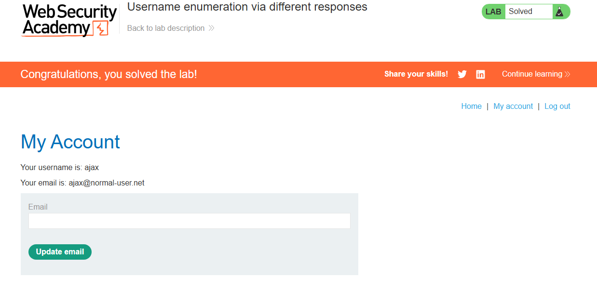

 # Lab: Username enumeration via different responses

**Módulo:** Server-side vulnerabilities //
**Dificuldade:** Apprentice //
**Categoria:** Authentication //
**Status:** Resolvida //

## Objetivo

Este laboratório está vulnerável a ataques de enumeração de nomes de utilizador e de força bruta à palavra-passe. 
Possui uma conta com um nome de utilizador e uma palavra-passe previsíveis, que podem ser encontrados nas seguintes listas de palavras:

- [Candidate usernames](https://portswigger.net/web-security/authentication/auth-lab-usernames)
- [Candidate passwords](https://portswigger.net/web-security/authentication/auth-lab-passwords)

Para resolver o laboratório, enumere um nome de utilizador válido, utilize um ataque de força bruta para descobrir a palavra-passe desse utilizador e, em seguida, aceda à página da sua conta.

## Reconhecimento
Antes de qualquer coisa é preciso entender como iremos forçar a vulnerabilidade.
Para forçarmos ela, podemos usar dois programas:

- Burp suite na função **INTRUDER**, contudo, recomendado o pro, pois o community demora MUITO.
Caso não tenha o PRO
- OWASP ZAP (Ou só Zap) na função **FUZZ**. É mais rapido e gratuito.

Neste caso, iremos usar o Zap.

## Abordagem

- Localizamos a URL do /login e efetuamos uma tentativa qualquer de entrada (usuario e senha) 
- Com isso, capturamos a solitação POST e podemos efetuar o *brute force*.
- Com o brute force finalizado, foi possivel conseguir o usuario e senha, entrando assim no perfil pedido.

## Payload / Técnica utilizada

### Enumeração de usuário

Foi realizado um ataque de fuzzing no parâmetro `username` e `password`.

Exemplo de requisição:

POST /login HTTP/1.1

username=§USER§
password=§PASSWORD§

Utilizando a lista proposta pelo Lab

## Evidência

----------------------------

## Resultado

O ataque permitiu identificar um nome de usuário válido através das diferenças nas mensagens retornadas pelo servidor.

## Observações técnicas

Por que a falha ocorre?

- A vulnerabilidade ocorre porque a aplicação fornece respostas diferentes para usuários existentes e inexistentes durante o processo de autenticação.

- Essas diferenças podem aparecer nas mensagens exibidas, no código HTTP, no tamanho da resposta ou até mesmo no tempo de processamento.

- Esse comportamento permite que um atacante descubra quais contas são válidas antes mesmo de tentar descobrir suas senhas, reduzindo significativamente o esforço necessário para um ataque de força bruta.

Como mitigar?

- Utilizar mensagens de erro genéricas, como "Usuário ou senha inválidos", independentemente da causa da falha.
- Manter respostas com tamanho e tempo de processamento semelhantes para todas as tentativas de autenticação.
- Implementar limitação de tentativas (Rate Limiting).
- Bloquear temporariamente contas após diversas tentativas consecutivas.
- Utilizar autenticação multifator (MFA), reduzindo o impacto da descoberta da senha.
- Monitorar tentativas repetidas de login para identificar possíveis ataques automatizados.

## Referências

- [PortSwigger Web Security Academy](https://portswigger.net/web-security/authentication) (link para o tópico, não para a lab específica com solução)
