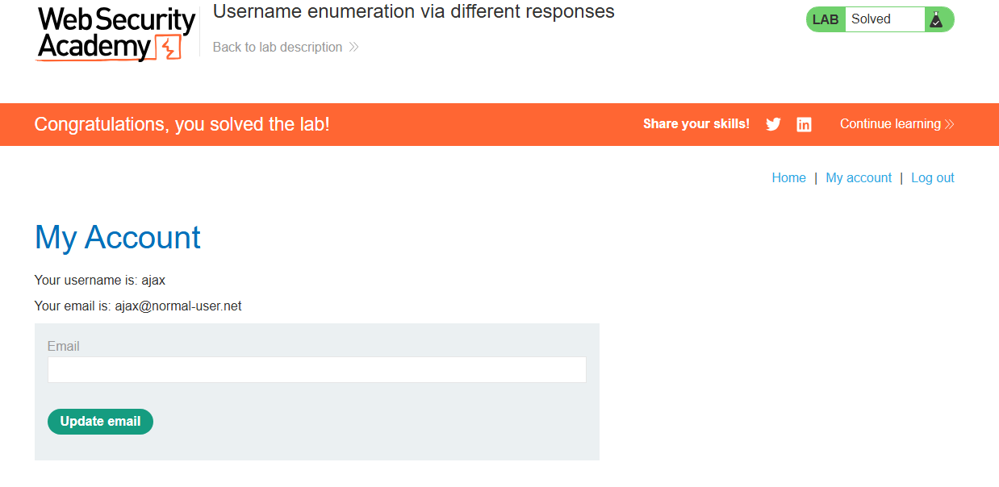

> 🌐 [English](LAB-01.md) | **Português**

# Lab: Username enumeration via different responses

**Módulo:** Server-side vulnerabilities //
**Dificuldade:** Apprentice //
**Categoria:** Authentication //
**Status:** Resolvida //

## Objetivo

Este laboratório está vulnerável a ataques de enumeração de nomes de usuário e de força bruta à senha.
Possui uma conta com um nome de usuário e uma senha previsíveis, que podem ser encontrados nas seguintes listas de palavras:

- [Candidate usernames](https://portswigger.net/web-security/authentication/auth-lab-usernames)
- [Candidate passwords](https://portswigger.net/web-security/authentication/auth-lab-passwords)

Para resolver o laboratório, enumere um nome de usuário válido, utilize um ataque de força bruta para descobrir a senha desse usuário e, em seguida, acesse a página da sua conta.

## Reconhecimento

Antes de qualquer coisa é preciso entender como iremos direcionar o ataque.
Para isso, podemos usar algum dos dois programas abaixo:

- Burp Suite na função **Intruder** — recomendado o Pro, pois o Community limita o Intruder e demora MUITO.

(Caso não tenha o Pro)

- OWASP ZAP (ou só ZAP) na função **Fuzz**. É mais rápido e gratuito.

Neste caso, iremos usar o ZAP.

## Abordagem

- Localizamos a URL do `/login` e efetuamos uma tentativa qualquer de entrada (usuário e senha).
- Com isso, capturamos a requisição POST e podemos efetuar o ataque.
- O ataque é feito em duas etapas: primeiro enumeramos um usuário válido, depois fazemos a força bruta da senha desse usuário.
- Com a senha descoberta, foi possível entrar no perfil pedido.

## Payload / Técnica utilizada

### 1. Enumeração de usuário

Foi realizado um ataque de fuzzing apenas no parâmetro `username`, mantendo o `password` fixo. O usuário válido é identificado pela diferença na resposta do servidor (mensagem de erro diferente para contas existentes vs. inexistentes).

```
POST /login HTTP/1.1

username=§USER§
password=qualquercoisa
```

### 2. Força bruta da senha

Com o usuário válido em mãos, um segundo ataque foi executado — desta vez fixando o `username` e fazendo fuzzing no `password` com a wordlist de senhas candidatas. A senha válida é a que quebra o padrão (ex: um redirect `302` ou uma resposta sem a mensagem de erro).

```
POST /login HTTP/1.1

username=<usuario_valido>
password=§PASSWORD§
```

Ambas as etapas usam as listas fornecidas pelo Lab.

## Evidência


----------------------------


## Resultado

O ataque permitiu identificar um nome de usuário válido através das diferenças nas mensagens retornadas pelo servidor e, em seguida, quebrar a senha correspondente por força bruta para acessar a conta.

## Observações técnicas

Por que a falha ocorre?

- A vulnerabilidade ocorre porque a aplicação fornece respostas diferentes para usuários existentes e inexistentes durante o processo de autenticação.
- Essas diferenças podem aparecer nas mensagens exibidas, no código HTTP, no tamanho da resposta ou até mesmo no tempo de processamento.
- Esse comportamento permite que um atacante descubra quais contas são válidas antes mesmo de tentar descobrir suas senhas, reduzindo significativamente o esforço necessário para um ataque de força bruta.

Como mitigar?

- Utilizar mensagens de erro genéricas, como "Usuário ou senha inválidos", independentemente da causa da falha.
- Manter respostas com tamanho e tempo de processamento semelhantes para todas as tentativas de autenticação.
- Implementar limitação de tentativas (Rate Limiting).
- Bloquear temporariamente contas após diversas tentativas consecutivas.
- Utilizar autenticação multifator (MFA), reduzindo o impacto da descoberta da senha.
- Monitorar tentativas repetidas de login para identificar possíveis ataques automatizados.

## Referências

- [PortSwigger Web Security Academy](https://portswigger.net/web-security/authentication) (link para o tópico, não para a lab específica com solução)
