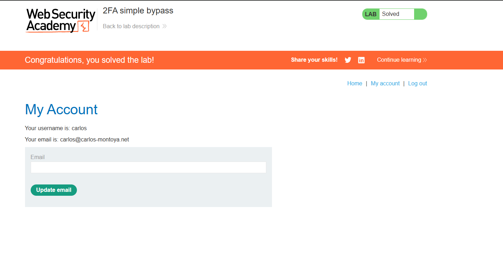

 # Lab: 2FA simple bypass

**Módulo:** Server-side vulnerabilities //
**Dificuldade:** Apprentice //
**Categoria:** Authentication //
**Status:** Resolvida //

## Objetivo

A autenticação de dois fatores deste laboratório pode ser contornada. Já obteve um nome de utilizador e uma palavra-passe válidos, mas não tem acesso ao código de verificação 2FA do utilizador. Para resolver o laboratório, aceda à página da conta do Carlos.

- As suas credenciais: wiener:peter
- Credenciais da vítima: carlos:montoya

## Reconhecimento

Ao analisar o fluxo de autenticação, foi observado que o sistema utiliza autenticação em dois fatores (2FA).

Inicialmente foi realizado login com a conta fornecida (`wiener:peter`) para compreender o funcionamento da aplicação. 
Após informar usuário e senha, o sistema solicita um código de verificação enviado por e-mail.

Durante esse processo foi identificado que, antes mesmo de inserir o código 2FA, a sessão do usuário já havia sido criada.

## Abordagem

- Foi realizado login utilizando as credenciais da vítima (`carlos:montoya`).
- Após o redirecionamento para a página de verificação 2FA (`/login2`), o código não foi informado.
- Em vez disso, a URL foi alterada manualmente para `/my-account`.
- O servidor permitiu o acesso direto à página da conta da vítima, ignorando a etapa obrigatória de verificação do segundo fator.
- Com isso, o laboratório foi concluído.

## Payload / Técnica utilizada

### Bypass da autenticação em dois fatores

Não foi necessário utilizar payloads ou ataques de força bruta.

A exploração consistiu apenas em alterar manualmente a URL: /login2 → /my-account

A aplicação validava apenas a existência da sessão autenticada, sem verificar se o processo de autenticação 2FA havia sido concluído.

## Evidência

## Resultado

Foi possível acessar a página da conta do usuário **Carlos** sem possuir o código de autenticação de dois fatores, demonstrando uma falha na implementação do fluxo de autenticação.

## Observações técnicas

### Por que a falha ocorre?

A aplicação cria uma sessão autenticada imediatamente após a validação do usuário e senha.
-
A etapa de autenticação em dois fatores funciona apenas como uma página intermediária, mas não é validada quando o usuário acessa recursos protegidos.
-
Dessa forma, basta acessar diretamente uma página autenticada para ignorar completamente o 2FA.

### Como mitigar?

- Criar a sessão autenticada somente após a validação do segundo fator.
- Utilizar um estado intermediário para usuários que ainda não concluíram o 2FA.
- Verificar, em todas as páginas protegidas, se a autenticação em dois fatores foi concluída antes de liberar o acesso.
- Impedir o acesso direto a recursos protegidos enquanto o processo de autenticação estiver incompleto.

## Referências

- [PortSwigger Web Security Academy](https://portswigger.net/web-security/authentication) (link para o tópico, não para a lab específica com solução)
