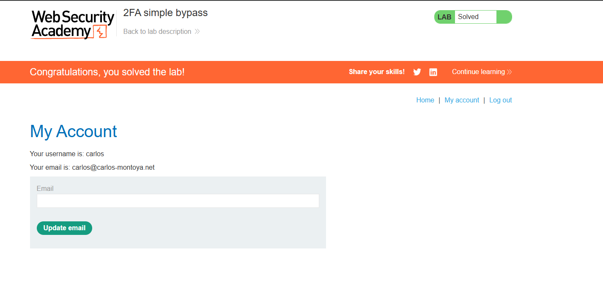

> 🌐 **English** | [Português](LAB-02.pt-BR.md)

# Lab: 2FA simple bypass

**Module:** Server-side vulnerabilities //
**Difficulty:** Apprentice //
**Category:** Authentication //
**Status:** Solved //

## Goal

This lab's two-factor authentication can be bypassed. You already have a valid username and password, but you don't have access to the user's 2FA verification code. To solve the lab, access Carlos's account page.

- Your credentials: `wiener:peter`
- Victim's credentials: `carlos:montoya`

## Recon

While analyzing the authentication flow, it was observed that the system uses two-factor authentication (2FA).

First, I logged in with the provided account (`wiener:peter`) to understand how the application works.
After entering the username and password, the system asks for a verification code sent by email.

During this process, it was identified that the user's session was already created **before** the 2FA code was even entered.

## Approach

- Logged in using the victim's credentials (`carlos:montoya`).
- After being redirected to the 2FA verification page (`/login2`), the code was not entered.
- Instead, the URL was manually changed to `/my-account`.
- The server allowed direct access to the victim's account page, skipping the mandatory second-factor verification step.
- With that, the lab was solved.

## Payload / Technique used

### Two-factor authentication bypass

No payloads or brute-force attacks were needed.

The exploitation consisted only of manually changing the URL: `/login2` → `/my-account`.

The application only validated the existence of an authenticated session, without checking whether the 2FA process had been completed.

## Evidence

## Result

It was possible to access **Carlos's** account page without the two-factor authentication code, demonstrating a flaw in the authentication flow implementation.

## Technical notes

### Why does the flaw occur?

The application creates an authenticated session immediately after validating the username and password.

The two-factor authentication step works only as an intermediate page, but it is not enforced when the user accesses protected resources.

As a result, simply accessing an authenticated page directly is enough to bypass 2FA entirely.

### How to mitigate?

- Create the authenticated session only after the second factor is validated.
- Use an intermediate state for users who haven't completed 2FA yet.
- On every protected page, verify that two-factor authentication was completed before granting access.
- Block direct access to protected resources while the authentication process is incomplete.

## References

- [PortSwigger Web Security Academy](https://portswigger.net/web-security/authentication) (link to the topic, not to the specific lab solution)
