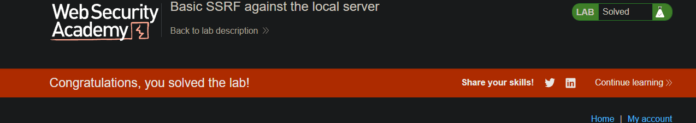
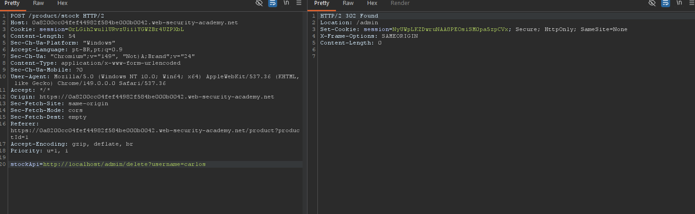

# Basic SSRF against the local server

**Módulo:** Server-side vulnerabilities //
**Dificuldade:** Apprentice //
**Categoria:** Server-side request forgery (SSRF) //
**Status:** Resolvida

## Objetivo

Este laboratório possui um recurso de verificação de estoque que obtém dados de um sistema interno.

Para resolver o laboratório, altere a URL da verificação de estoque para acessar a interface de administração em http://localhost/admin e exclua o usuário Carlos.

## Reconhecimento

O laboratório disponibiliza uma funcionalidade de verificação de estoque (Check stock), que realiza uma requisição para um servidor interno responsável por consultar a disponibilidade dos produtos.

Ao interceptar a requisição utilizando o Burp Suite, foi possível identificar o parâmetro stockApi, responsável por informar ao servidor qual endereço deve ser consultado para obter as informações de estoque.

Essa característica indica uma possível vulnerabilidade de Server-Side Request Forgery (SSRF), pois a aplicação realiza requisições HTTP em nome do usuário utilizando a URL fornecida pelo parâmetro.

## Abordagem

- Acessamos a página de um produto qualquer.
- Selecionamos a opção Check stock para gerar a requisição ao servidor.
- Interceptamos a requisição POST /product/stock utilizando o Burp Suite.
- Identificamos o parâmetro stockApi, que apontava para o servidor interno de estoque.
- Alteramos seu valor para http://localhost/admin.
- A resposta retornou o painel administrativo interno da aplicação, revelando o endpoint responsável pela exclusão de usuários.
- Identificamos a URL /delete?username=carlos.
- Modificamos novamente o parâmetro stockApi para apontar diretamente para esse endpoint.
- Após enviar a requisição, o usuário carlos foi removido e o laboratório foi concluído.

## Payload / Técnica utilizada

```
POST /product/stock HTTP/1.1

stockApi=http://localhost/admin

```
Após identificar o endpoint administrativo:

```
POST /product/stock HTTP/1.1

stockApi=http://localhost/admin/delete?username=carlos

```

## Evidência




## Resultado

A vulnerabilidade permitiu que o servidor realizasse requisições HTTP para recursos internos inacessíveis externamente.

## Observações técnicas

### Por que a falha ocorre?

- A aplicação aceita uma URL fornecida pelo usuário e realiza a requisição diretamente no lado do servidor, sem validar adequadamente o destino.
- Como o servidor possui acesso à rede interna, um atacante pode utilizá-lo para acessar recursos que normalmente não estariam disponíveis externamente.
- Isso permite consultar serviços internos, acessar interfaces administrativas e, em alguns casos, interagir com outros sistemas da infraestrutura.

### Como mitigar?

- Nunca permitir que o cliente controle diretamente a URL de destino das requisições.
- Utilizar uma lista de permissões (*allowlist*) contendo apenas os domínios necessários.
- Bloquear requisições destinadas a endereços internos, como `localhost`, `127.0.0.1` e redes privadas.
- Validar rigorosamente o protocolo e o destino das URLs recebidas.
- Segmentar a rede interna e restringir o acesso dos serviços a recursos administrativos.


## Referências

- [PortSwigger Web Security Academy](https://portswigger.net/web-security/ssrf) (link para o tópico, não para a lab específica com solução)
