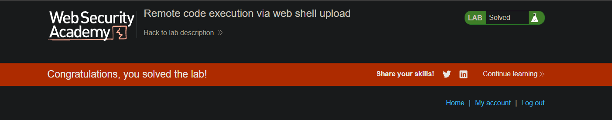
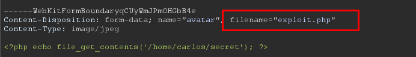

**Módulo:** Server-side vulnerabilities //
**Dificuldade:** Apprentice //
**Categoria:** File upload vulnerabilities //
**Status:** Resolvida

## Objetivo

Este laboratório possui uma funcionalidade de upload de imagens vulnerável, que não realiza qualquer validação dos arquivos enviados antes de armazená-los no sistema de arquivos do servidor.

Para resolver o laboratório, era necessário enviar um web shell em PHP, executá-lo no servidor para obter o conteúdo do arquivo `/home/carlos/secret` e, em seguida, submeter o segredo utilizando o botão disponibilizado pelo laboratório.

Foi utilizada a conta fornecida pelo próprio exercício:

```
Usuário: wiener
Senha: peter
```

## Reconhecimento

O enunciado informa que a funcionalidade de upload não realiza validação dos arquivos enviados, indicando uma possível vulnerabilidade de **File Upload** capaz de permitir a execução de código remoto.

Após realizar o upload de uma imagem de teste e interceptar a requisição utilizando o Burp Suite, foi possível analisar tanto a requisição **POST**, responsável pelo envio do arquivo, quanto a requisição **GET**, utilizada posteriormente para acessar o arquivo armazenado.

Essa análise demonstrou que os arquivos enviados eram disponibilizados diretamente pelo servidor, levantando a hipótese de que seria possível enviar um arquivo PHP em vez de uma imagem e executá-lo remotamente.

## Abordagem

- Realizamos login utilizando as credenciais fornecidas pelo laboratório.
- Acessamos a funcionalidade de upload de avatar.
- Efetuamos o upload de uma imagem qualquer para compreender o funcionamento da aplicação.
- Interceptamos a requisição **POST** utilizando o Burp Suite.
- Substituímos o conteúdo da imagem por um arquivo PHP contendo um web shell simples.
- Encaminhamos a requisição modificada ao servidor.
- Após o upload, interceptamos a requisição **GET** responsável por acessar a imagem enviada.
- Alteramos o caminho do arquivo para acessar o arquivo PHP enviado ao servidor.
- Ao acessar o arquivo, o código PHP foi executado pelo servidor e retornou o conteúdo de `/home/carlos/secret`.
- O segredo obtido foi enviado ao laboratório, concluindo o desafio.

## Payload / Técnica utilizada

### Conteúdo enviado via POST

```php
<?php echo file_get_contents('/home/carlos/secret'); ?>
```

### Requisição original

```http
GET /files/avatars/cat.png HTTP/1.1
```

### Requisição modificada

```http
GET /files/avatars/exploit.php HTTP/1.1
```

## Evidência





## Resultado

A exploração confirmou uma vulnerabilidade de **Unrestricted File Upload**, permitindo o envio e a execução de um arquivo PHP diretamente no servidor.

Como consequência, foi possível obter execução remota de código (Remote Code Execution - RCE) e acessar informações sensíveis armazenadas no sistema de arquivos, neste caso o conteúdo do arquivo `/home/carlos/secret`, suficiente para concluir o laboratório.

## Observações técnicas

### Por que a falha ocorre?

- A aplicação aceita arquivos enviados pelo usuário sem validar sua extensão ou conteúdo.
- O servidor armazena esses arquivos em um diretório acessível pela web.
- Como o servidor interpreta arquivos PHP, um atacante pode enviar código malicioso e executá-lo simplesmente acessando sua URL.
- Esse comportamento caracteriza uma vulnerabilidade de **Unrestricted File Upload**, frequentemente resultando em **Remote Code Execution (RCE)**.

### Como mitigar?

- Permitir apenas tipos específicos de arquivos (*allowlist*), em vez de bloquear extensões conhecidas.
- Validar o tipo MIME e a assinatura (*magic bytes*) do arquivo enviado.
- Armazenar uploads fora da raiz pública da aplicação.
- Configurar o servidor para impedir a execução de scripts em diretórios destinados a uploads.
- Renomear os arquivos enviados para evitar manipulação de extensões e caminhos.
- Implementar mecanismos de autenticação e autorização para acesso aos arquivos enviados.

## Referências

- [PortSwigger Web Security Academy](https://portswigger.net/web-security/file-upload) (link para o tópico, não para a lab específica com solução)
- OWASP Web Security Testing Guide - File Upload Testing
- CWE-434 - Unrestricted Upload of File with Dangerous Type