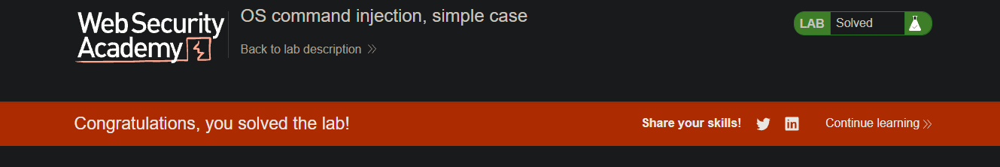
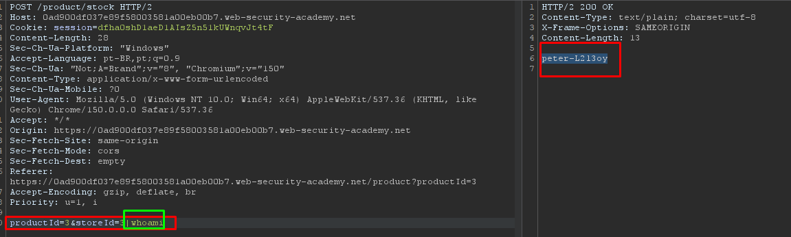

> 🌐 [English](LAB-01.md) | **Português**

# Lab: OS command injection, simple case

**Módulo:** Server-side vulnerabilities //
**Dificuldade:** Apprentice //
**Categoria:** OS command injection //
**Status:** Resolvida //

## Objetivo

Este laboratório contém uma vulnerabilidade de **OS Command Injection** na funcionalidade de consulta de estoque dos produtos.

Para resolver o laboratório, era necessário explorar essa vulnerabilidade para executar o comando `whoami` no servidor e identificar o usuário responsável pela execução da aplicação.

## Reconhecimento

O enunciado do laboratório indica a presença de uma vulnerabilidade de **OS Command Injection**.

Com base nas orientações fornecidas pela própria PortSwigger durante o laboratório, foi realizada a análise das requisições responsáveis pela consulta de estoque dos produtos.

Ao utilizar a funcionalidade **Check stock** e interceptar a comunicação através do Burp Suite, foi identificada a requisição:

```http
POST /product/stock
```

Essa requisição enviava os parâmetros:

```text
productId=3&storeId=3
```

Como esses parâmetros eram utilizados pelo servidor para consultar o estoque do produto, surgiu a hipótese de que algum deles pudesse estar sendo concatenado diretamente a um comando do sistema operacional sem validação adequada.

## Abordagem

- Acessamos a página de um produto qualquer.
- Selecionamos a opção **Check stock**.
- Interceptamos a requisição `POST /product/stock` utilizando o Burp Suite.
- Encaminhamos a requisição para o Repeater.
- Modificamos o parâmetro `storeId`, acrescentando um operador de shell (`|`) seguido do comando `whoami`.

O payload utilizado foi:

```text
productId=3&storeId=3|whoami
```

- Após reenviar a requisição, o servidor executou o comando adicional.
- A resposta retornou o usuário responsável pela execução da aplicação, confirmando a existência da vulnerabilidade de **OS Command Injection**.
- Com isso, o laboratório foi concluído.

## Payload / Técnica utilizada

### Requisição original

```text
productId=3&storeId=3
```

### Payload utilizado

```text
productId=3&storeId=3|whoami
```

## Evidência





## Resultado

A exploração confirmou uma vulnerabilidade de **OS Command Injection**, permitindo a execução de comandos arbitrários no sistema operacional por meio de um parâmetro controlado pelo usuário.

Foi possível executar o comando `whoami`, obtendo o usuário responsável pela execução da aplicação no servidor e comprovando a execução remota de comandos.

## Observações técnicas

### Por que a falha ocorre?

A aplicação utiliza um parâmetro fornecido pelo usuário para compor um comando do sistema operacional sem realizar validação ou sanitização adequada.

O operador `|` é interpretado pelo shell como um operador de encadeamento de comandos, fazendo com que o comando original seja executado normalmente e, em seguida, execute também o comando informado pelo atacante.

Essa prática permite que usuários maliciosos executem comandos arbitrários no sistema operacional, podendo resultar em comprometimento total do servidor.

### Como mitigar?

- Evitar a execução de comandos do sistema operacional sempre que existir uma alternativa utilizando funções nativas da linguagem.
- Nunca concatenar diretamente dados controlados pelo usuário em comandos do sistema.
- Validar rigorosamente todos os parâmetros recebidos.
- Utilizar listas de permissões (*allowlists*) para valores esperados.
- Quando necessário executar comandos externos, utilizar APIs que não invoquem o shell do sistema.
- Executar a aplicação com o princípio do menor privilégio, limitando o impacto de uma eventual exploração.

## Referências

- [PortSwigger Web Security Academy](https://portswigger.net/web-security/os-command-injection) (link para o tópico, não para a lab específica com solução)
- OWASP Web Security Testing Guide - Command Injection
- CWE-78 - Improper Neutralization of Special Elements used in an OS Command
