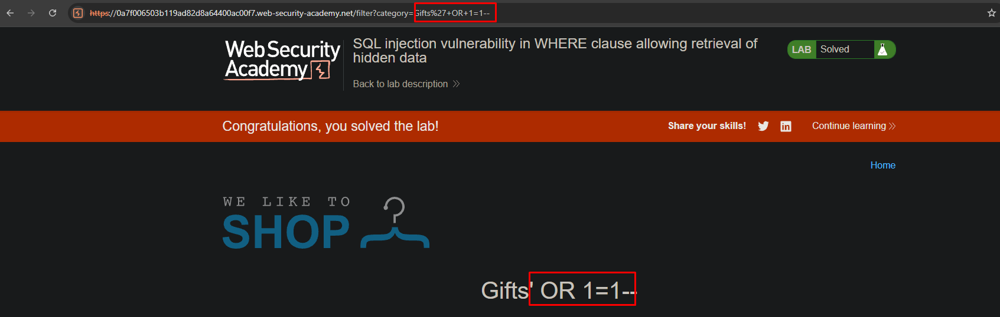

# Lab: SQL injection vulnerability in WHERE clause allowing retrieval of hidden data

**Módulo:** SQL injection //
**Dificuldade:** Apprentice //
**Categoria:** SQL Injection //
**Status:** Resolvida

## Objetivo

Este laboratório contém uma vulnerabilidade de **SQL Injection** no filtro de categorias dos produtos.

Sempre que uma categoria é selecionada, a aplicação executa uma consulta semelhante à seguinte:

```sql
SELECT * FROM products WHERE category = 'Gifts' AND released = 1
```

Para concluir o laboratório, era necessário modificar essa consulta para que também fossem exibidos produtos ainda não publicados (*unreleased products*).

## Reconhecimento

Ao selecionar uma categoria de produtos, foi observado que a URL continha o parâmetro responsável pelo filtro:

```text
/filter?category=Gifts
```

O enunciado do laboratório informa que esse parâmetro é utilizado diretamente na cláusula **WHERE** da consulta SQL.

Isso indica que, caso a entrada do usuário não seja devidamente validada, é possível alterar a lógica da consulta por meio de uma injeção SQL.

## Abordagem

- Selecionamos uma categoria qualquer de produtos.
- Identificamos o parâmetro `category` na URL.
- Modificamos seu valor acrescentando um payload de SQL Injection.
- O payload utilizado fecha a string original, adiciona uma condição sempre verdadeira (`OR 1=1`) e comenta o restante da consulta utilizando `--`.
- Após enviar a requisição, a aplicação passou a retornar todos os produtos cadastrados, incluindo aqueles que ainda não haviam sido publicados.
- A exibição dos produtos ocultos concluiu o laboratório.

## Payload / Técnica utilizada

### URL original

```text
/filter?category=Gifts
```

### Payload utilizado

```text
/filter?category=Gifts'+OR+1=1--
```

### Consulta original

```sql
SELECT *
FROM products
WHERE category = 'Gifts'
AND released = 1;
```

### Consulta após a injeção

```sql
SELECT *
FROM products
WHERE category = 'Gifts'
OR 1=1--'
AND released = 1;
```

## Evidência



## Resultado

A exploração confirmou uma vulnerabilidade de **SQL Injection**, permitindo alterar a lógica da cláusula **WHERE** da consulta SQL.

Ao utilizar uma condição sempre verdadeira (`OR 1=1`), foi possível ignorar a restrição responsável por exibir apenas produtos publicados, fazendo com que a aplicação retornasse também os produtos ocultos (*unreleased products*), concluindo o laboratório.

## Observações técnicas

### Por que a falha ocorre?

A aplicação concatena diretamente o valor informado pelo usuário na consulta SQL, sem realizar validação ou utilizar consultas parametrizadas.

O payload utilizado fecha a string da categoria (`'`), adiciona a condição `OR 1=1`, que sempre será verdadeira, e utiliza `--` para comentar o restante da instrução SQL.

Como resultado, a cláusula responsável por filtrar apenas produtos publicados (`AND released = 1`) deixa de ser considerada pelo banco de dados.

### Como mitigar?

- Utilizar **consultas parametrizadas (Prepared Statements)** em todas as interações com o banco de dados.
- Nunca concatenar entradas controladas pelo usuário diretamente em consultas SQL.
- Validar os parâmetros recebidos utilizando listas de permissões (*allowlists*) sempre que possível.
- Aplicar o princípio do menor privilégio às contas utilizadas pela aplicação para acesso ao banco de dados.
- Implementar tratamento adequado de erros para evitar exposição de informações sobre a estrutura das consultas.

## Referências

- PortSwigger Web Security Academy - SQL Injection
- OWASP Web Security Testing Guide - SQL Injection
- CWE-89 - Improper Neutralization of Special Elements used in an SQL Command ('SQL Injection')
## Referências

- [PortSwigger Web Security Academy](https://portswigger.net/web-security/sql-injection) (link para o tópico, não para a lab específica com solução)
- OWASP Web Security Testing Guide - SQL Injection
- CWE-89 - Improper Neutralization of Special Elements used in an SQL Command ('SQL Injection')


