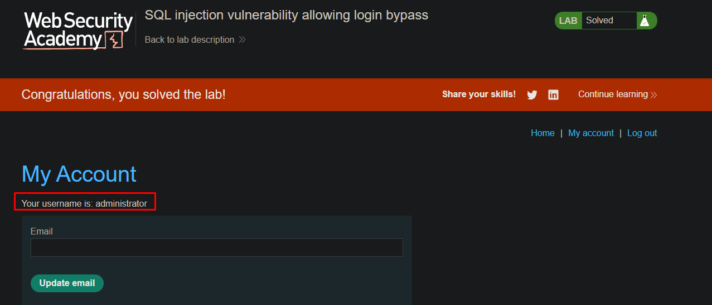

> 🌐 [English](LAB-02.md) | **Português**

# Lab: SQL injection vulnerability allowing login bypass

**Módulo:** SQL injection //
**Dificuldade:** Apprentice //
**Categoria:** SQL Injection //
**Status:** Resolvida //

## Objetivo

Este laboratório contém uma vulnerabilidade de **SQL Injection** na funcionalidade de autenticação.

Para resolver o laboratório, era necessário explorar essa vulnerabilidade para realizar login como o usuário **administrator**, sem conhecer sua senha.

## Reconhecimento

O laboratório disponibiliza uma página de autenticação composta pelos campos **Username** e **Password**.

Como informado pelo enunciado, a aplicação é vulnerável a **SQL Injection** durante o processo de login, indicando que os valores informados pelo usuário provavelmente são inseridos diretamente na consulta SQL responsável pela autenticação.

Essa característica sugere a possibilidade de alterar a estrutura da consulta para ignorar a validação da senha.

## Abordagem

- Acessamos a página de login da aplicação.
- No campo **Username**, informamos um payload de SQL Injection para encerrar a string e comentar o restante da consulta.
- No campo **Password**, informamos `--`, pois sua verificação seria comentada pela injeção (qualquer valor funcionaria aqui, já que a senha nunca é avaliada).
- Após enviar o formulário, a aplicação autenticou a sessão como o usuário **administrator**, concluindo o laboratório.

## Payload / Técnica utilizada

### Credenciais utilizadas

**Username**

```text
administrator'--
```

**Password**

```text
--
```

### Exemplo da lógica da consulta

Consulta esperada pela aplicação:

```sql
SELECT *
FROM users
WHERE username = 'administrator'
AND password = 'senha';
```

Consulta após a injeção:

```sql
SELECT *
FROM users
WHERE username = 'administrator'--'
AND password = '--';
```

Como `--` inicia um comentário em SQL, todo o restante da instrução — incluindo a verificação `AND password = '...'` — é ignorado pelo banco de dados. A consulta se torna efetivamente `WHERE username = 'administrator'`, de modo que a autenticação é bem-sucedida apenas com base no nome do usuário. O valor informado no campo de senha (`--`) nunca é avaliado pelo banco, pois cai dentro da parte comentada.

## Evidência



## Resultado

A exploração confirmou uma vulnerabilidade de **SQL Injection** na funcionalidade de autenticação.

Foi possível contornar completamente a verificação da senha e autenticar-se como o usuário **administrator**, demonstrando que a aplicação concatena diretamente dados controlados pelo usuário em consultas SQL.

## Observações técnicas

### Por que a falha ocorre?

A aplicação constrói a consulta SQL utilizando diretamente os valores informados pelo usuário, sem utilizar consultas parametrizadas.

Ao inserir o payload:

```text
administrator'--
```

a string é encerrada prematuramente e o operador `--` transforma o restante da consulta em comentário.

Dessa forma, a condição responsável por verificar a senha deixa de ser executada, permitindo que a autenticação seja realizada apenas com base no nome do usuário.

### Como mitigar?

- Utilizar **Prepared Statements** (consultas parametrizadas) para todas as consultas ao banco de dados.
- Nunca concatenar diretamente entradas fornecidas pelo usuário em instruções SQL.
- Validar e sanitizar os dados recebidos.
- Implementar autenticação utilizando consultas parametrizadas e comparação segura de credenciais.
- Aplicar o princípio do menor privilégio às contas utilizadas pela aplicação para acesso ao banco de dados.
- Evitar mensagens de erro detalhadas que possam auxiliar na exploração da vulnerabilidade.

## Referências

- [PortSwigger Web Security Academy](https://portswigger.net/web-security/sql-injection) (link para o tópico, não para a lab específica com solução)
- OWASP Web Security Testing Guide - SQL Injection
- CWE-89 - Improper Neutralization of Special Elements used in an SQL Command ('SQL Injection')
